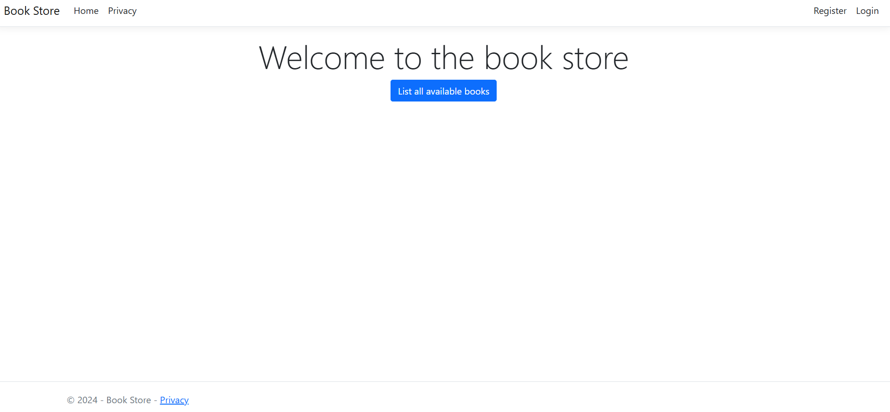
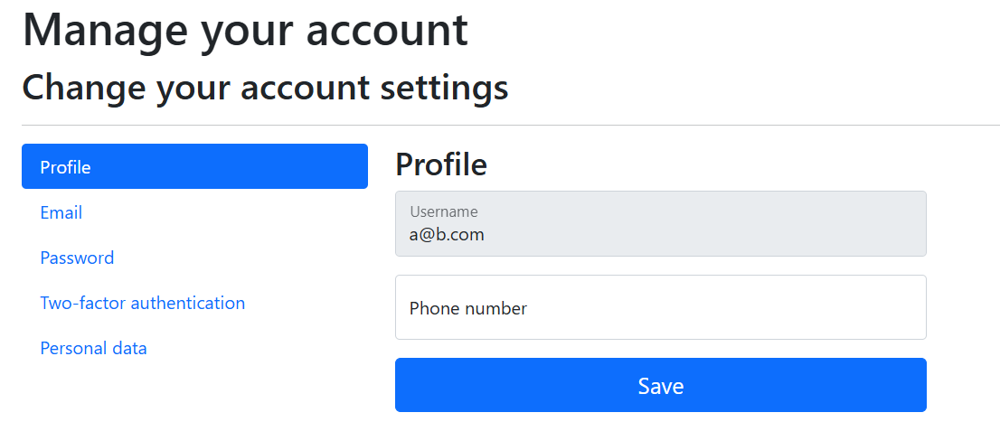
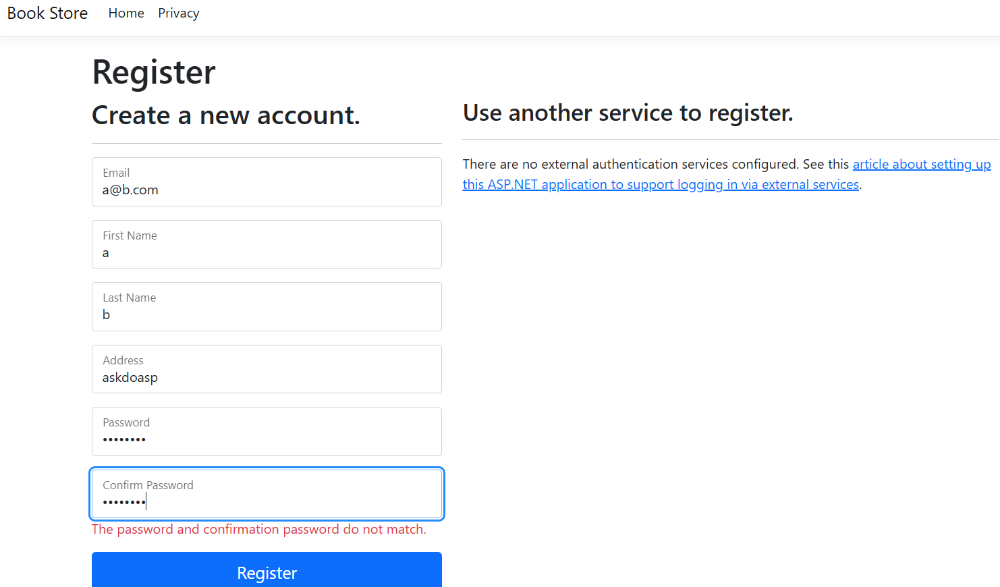
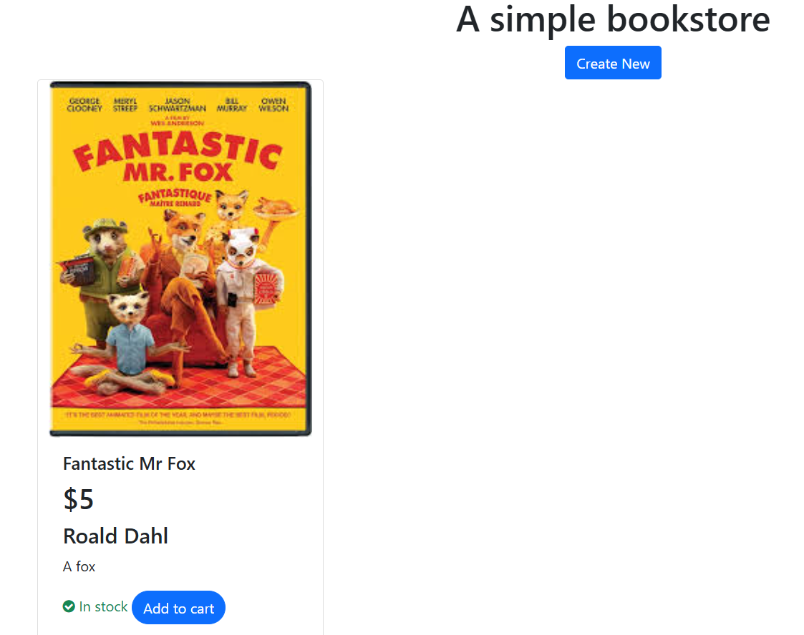
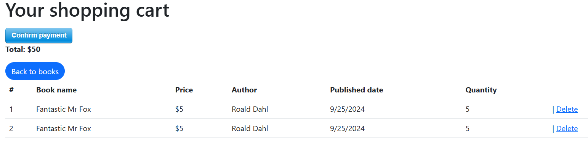
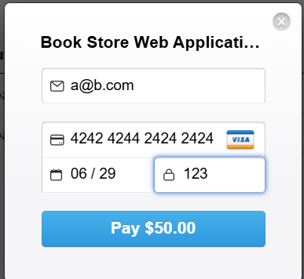

Book Store
=====================================

Overview
----------

**Book Store** is a online book e-shop developed with **.NET 8** using the **Model-View-Controller (MVC)** pattern. It strictly adheres to the **Onion Architecture** principles to achieve separation of concerns, testability, and a clean codebase. **Microsoft SQL Server** is utilized for data persistence, managed through **Entity Framework Core**. Remember that you need to change the API key for Stripe as it's blank

* * * * *

Features
-----------

-   **Book Catalog:** View, search, and filter the available book inventory.

-   **User Accounts:** Secure registration, login, and profile management using **ASP.NET Core Identity**.

-   **Shopping Cart:** Persistent cart management for adding, updating, and removing items.

-   **Order Processing:** A smooth checkout flow and the ability to view past order history using Stripe as a third party payment processor.

-   **Admin Dashboard:** Tools for **CRUD** (Create, Read, Update, Delete) operations on books and categories.

* * * * *

Technology Stack
-------------------

| **Category** | **Technology** | **Version** | **Purpose** |
| --- | --- | --- | --- |
| **Framework** | **.NET** | 8.0 | Core application foundation. |
| **Web UI** | ASP.NET Core **MVC** | 8.0 | Presentation layer and routing. |
| **Architecture** | **Onion** / Clean Arch. | N/A | Design pattern for layered separation. |
| **Database** | **Microsoft SQL Server** | (Any recent) | Primary data storage. |
| **ORM** | Entity Framework Core | 8.0 | Data access and database migrations. |
| **Styling** | Bootstrap | 5.4 | Responsive UI components. |

* * * * *

Architecture: Onion/Clean Architecture
-----------------------------------------

The solution is structured into distinct projects corresponding to the Onion Architecture layers, with dependencies flowing inward (from Presentation, to Application, to Domain):

1.  **Eshop.Domain:** Contains the business rules, **Entities** (e.g., `Book`, `Order`), and DTOs (`ShoppingCartDTO`).

2. **Eshop.Repository:** Contains the main repository for accessing the entities, and their respective interfaces are implemented.

2.  **Eshop.Services:** Implements the interfaces defined in the Domain and Application layers. This includes **Entity Framework Core** (database access), external service implementations, and dependency configurations.

3.  **Eshop.Web:** The outermost layer (**ASP.NET Core MVC**). Contains **Controllers**, **Views**, and sets up the application host and Dependency Injection.

* * * * *









Getting Started
------------------

### Prerequisites

-   **.NET 8 SDK**

-   **Microsoft SQL Server** (or LocalDB)

-   Visual Studio 2022 or VS Code

### Installation and Setup

1.  **Clone the Repository:**

    Bash

    ```
    git clone https://github.com/davidris123/book-eshop.git
    cd book-eshop

    ```

2.  **Configure the Database Connection:**

    -   Open `appsettings.json` in the **`Eshop.Web`** project.

    -   Update the `DefaultConnection` string to point to your local MS SQL Server instance.

    JSON

    ```
    "ConnectionStrings": {
      "DefaultConnection": "Server=(localdb)\\mssqllocaldb;Database=test;Trusted_Connection=True;MultipleActiveResultSets=true"
    }

    ```

3.  Run Database Migrations:

    Execute the following command from the solution root directory to create the database schema:

    Bash / .NET CLI

    ```
    dotnet ef database update --project Eshop.Repository --startup-project Eshop.Web

    ```

    In Visual Studio 2022

    ```
    Add-Migration initial
    Update-Database
    ```


4.  Run the Application:

    Start the MVC web project:

    Bash / .NET CLI

    ```
    dotnet run --project Eshop.Web
    ```

    In Visual Studio 2022
    
    ```
    Clone the repository and click on start. Make sure to not accept the SSL certificate
    ```
    

